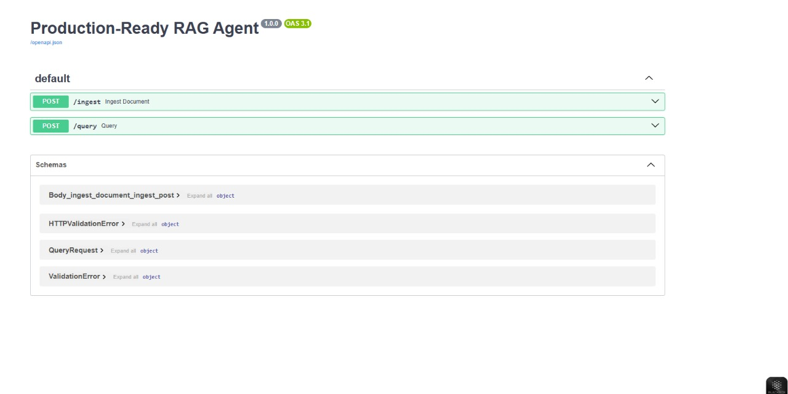
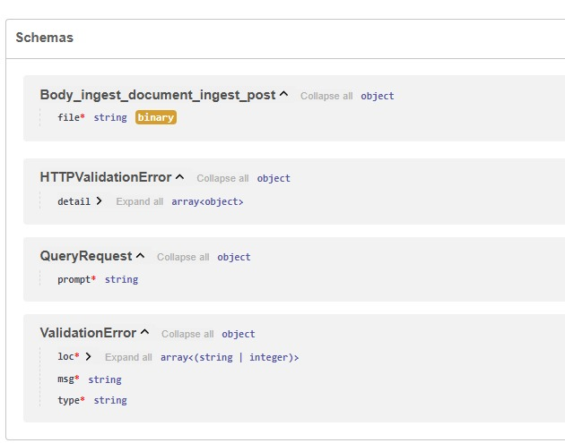
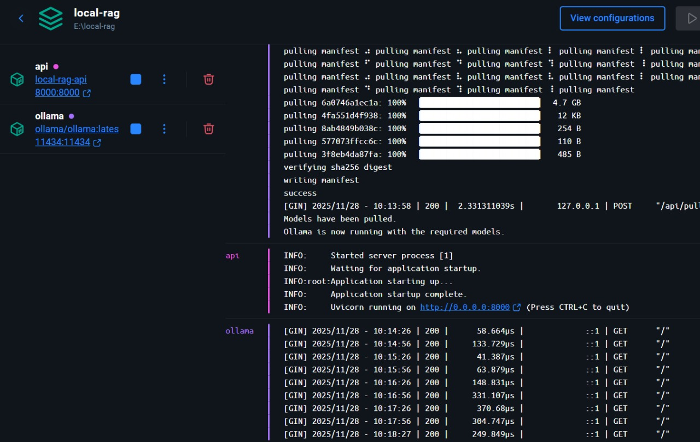
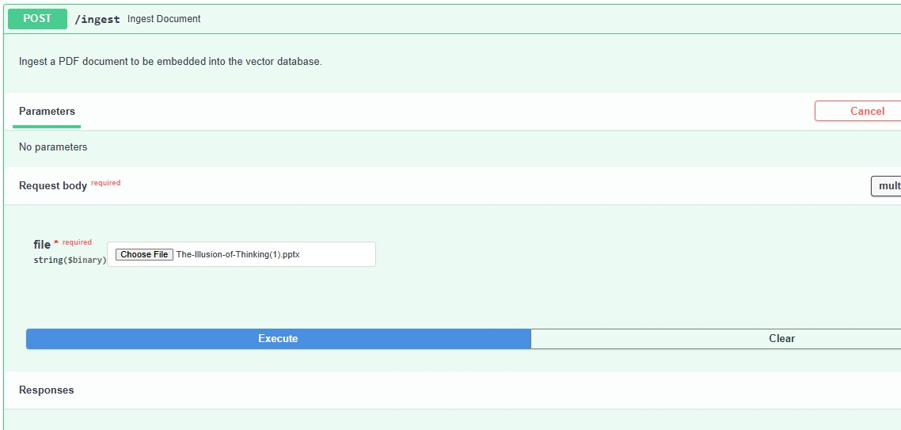

# 🧠 RAG_LLM — Local & Private Retrieval-Augmented Generation with FastAPI + Ollama + Qdrant

A fully local AI chatbot that can ingest your PDFs, store knowledge in a vector database, and answer questions **grounded** in your documents — with **no data leaving your machine**.

Built for fast iteration, privacy, and real-world usage.

---

## ⚡ Features

| Feature                    | Benefit                              |
| -------------------------- | ------------------------------------ |
| Local LLM (Ollama)         | No cloud charges, full privacy       |
| Qdrant Vector DB           | Fast semantic search                 |
| LangChain RAG Pipeline     | Accurate answers grounded in docs    |
| PDF ingestion              | Build your own knowledge base        |
| Chunking + embeddings      | Better recall and context coverage   |
| Dockerized deployment      | Works anywhere with a single command |
| Authentication via API Key | Blocks unauthorized access           |

---

## 🧩 Architecture

```
              ┌──────────────┐
    PDF ───►  │ Ingestion API │─────────┐
              └───────┬──────┘         │
                      │                 ▼
                Text Splitter      Qdrant VectorDB
                      │                 ▲
                      ▼                 │
                 Embedding Model ───────┘
                      │
                      ▼
     Question ─►  RAG Pipeline ─► Local LLM (Ollama)
                      │
                      ▼
                   Answer ✔
```



---


## 🏗 Tech Stack

* 🧩 **FastAPI**
* 🧬 **LangChain**
* 🧠 **Ollama** (Llama3 / Mistral models)
* 🗄 **Qdrant** (cloud or local)
* 🐳 **Docker & Docker Compose**

---

## 🚀 Getting Started

### Clone the repo

```bash
git clone https://github.com/Rishy-09/RAG_LLM.git
cd RAG_LLM
```

---

### Setup environment variables

Copy and fill your values:

```bash
cp .env.example .env
```

Required keys:

```
QDRANT_URL=YOUR_ENDPOINT
QDRANT_API_KEY=YOUR_KEY
QDRANT_COLLECTION=rag_collection

OLLAMA_HOST=http://localhost:11434
LLM_MODEL=llama3:instruct
TEXT_EMBEDDING_MODEL=nomic-embed-text

TEMP_FOLDER=./_temp
API_KEY=YOUR_FASTAPI_KEY
CHUNK_SIZE=1000
CHUNK_OVERLAP=150
TOP_K=5
```

> Don’t commit your real `.env` to GitHub. `.gitignore` protects it.

---


## ▶ Run with Docker

```bash
docker compose up --build
```

Wait until services are running.

---

## 🔌 API Endpoints

| Method | Endpoint  | Description                    |
| ------ | --------- | ------------------------------ |
| POST   | `/ingest` | Upload PDF → Embed into Qdrant |
| POST   | `/query`  | Ask a question, get RAG answer |
| GET    | `/docs`   | Swagger API UI                 |

Example request:

```bash
curl -X POST "http://localhost:8000/query" \
 -H "x-api-key: YOUR_KEY" \
 -H "Content-Type: application/json" \
 -d '{"question": "What does the PDF say about pricing?"}'
```


Response includes:
✔ Answer
✔ Source text chunks
✔ Confidence based on retrieval score

---

## 🧪 Local Model Downloads (Ollama)

Install Ollama: [https://ollama.ai](https://ollama.ai)

Pull a model:

```bash
ollama pull llama3:instruct
```



Switch models easily via `.env`.

---

## 🔐 Security Notes

* API requires `x-api-key`
* CORS restricted (only allowed origins)
* Secrets never stored in Git
* Safe for local confidential documents

---

## 🛤 Roadmap

* Web UI for chatting with sources
* Streaming responses
* Multi-user document buckets
* Citations with timestamps + PDF page mapping

---


## 🖤 Credits

Made by Naman (Rishy-09)
Open-source forever.
---