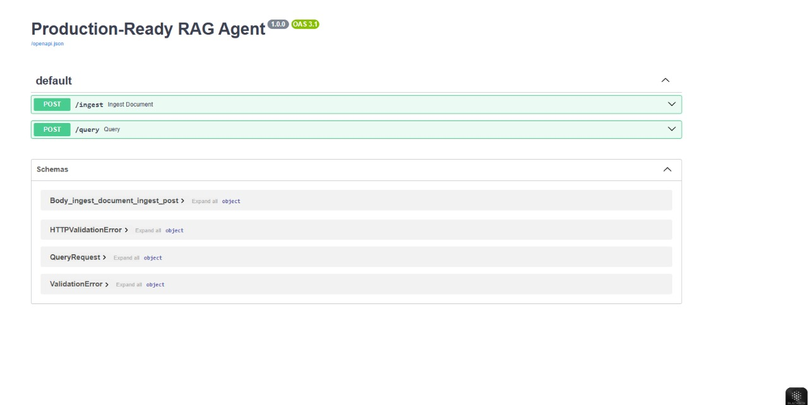
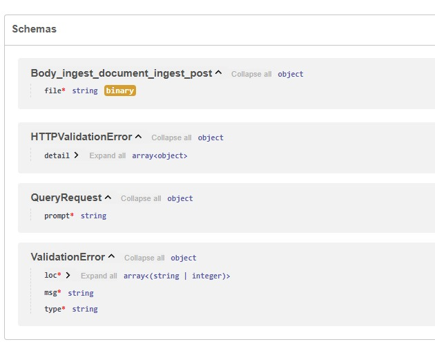
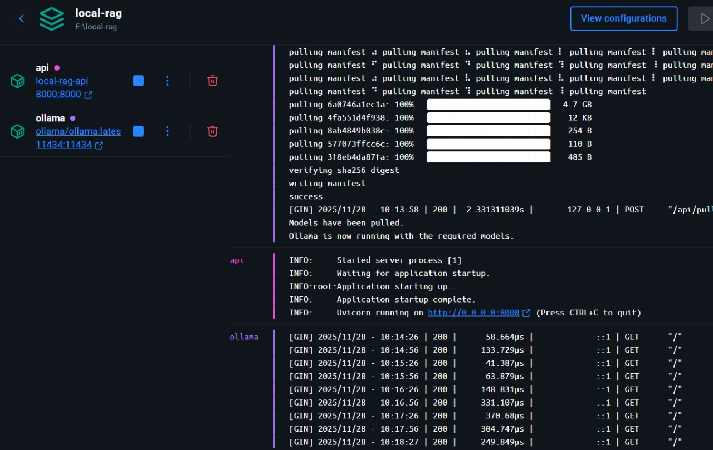
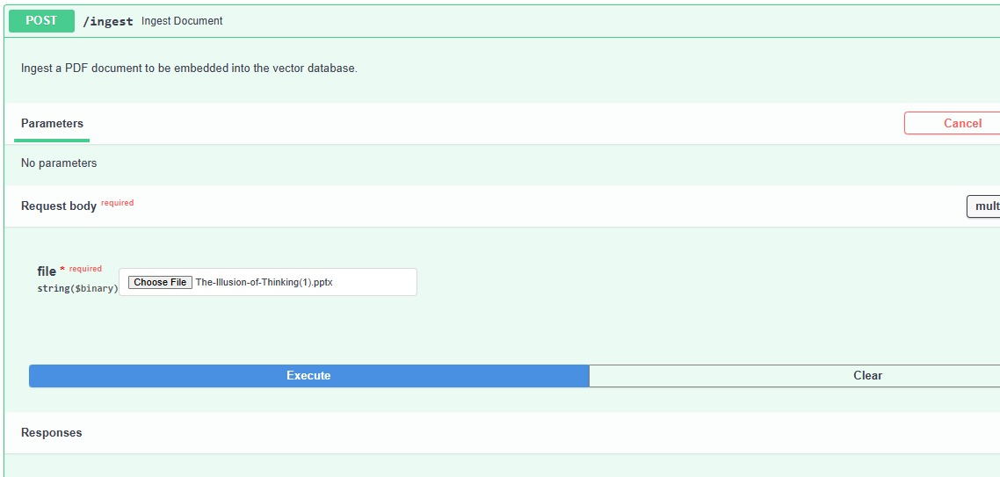
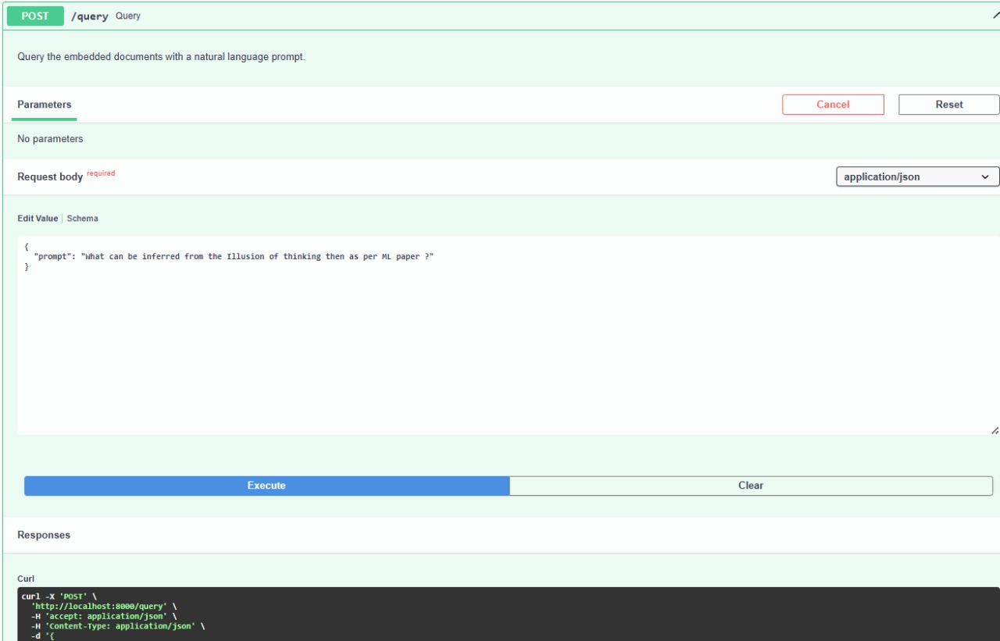

# 🧠 RAG_LLM — Local & Private Retrieval-Augmented Generation with FastAPI + Ollama + Qdrant

A fully local AI chatbot that can ingest your PDFs, store knowledge in a vector database, and answer questions **grounded** in your documents — with **no data leaving your machine**.

Built for fast iteration, privacy, and real-world usage.

---

## How to start the project on Windows

This project runs in two parts:

* **Ollama** runs directly on Windows and provides the local embedding and chat models.
* **FastAPI** runs in Docker and connects to Ollama through
  `host.docker.internal`.
* **Qdrant** stores the document vectors in your Qdrant Cloud cluster.

### Before the first start

Make sure Docker Desktop is open and its engine says **Running**. You also need
Ollama running on Windows. This project does not start an Ollama container.

Open Command Prompt or PowerShell and go to the project folder:

```cmd
cd /d E:\RAG_LLM
```

Check that Ollama is available and that both required models are installed:

```cmd
ollama list
```

The list should contain `nomic-embed-text` and `llama3:instruct`. Install a
missing model once with:

```cmd
ollama pull nomic-embed-text
ollama pull llama3:instruct
```

If Ollama is not running, start the Ollama application from the Windows Start
menu. You can also check its local API in a browser at
<http://localhost:11434/api/tags>.

### Configure `.env`

Create the environment file only if it does not already exist:

```cmd
copy .env.example .env
```

Open `.env` and set your Qdrant Cloud values and a private API key:

```env
QDRANT_URL="https://your-cluster.region.cloud.qdrant.io:6333"
QDRANT_API_KEY="your-qdrant-manage-write-api-key"
QDRANT_COLLECTION="rag_collection"
API_KEY="choose-a-private-api-key-for-this-app"
```

Use the exact cluster URL from Qdrant Cloud. The collection should use 768
dimensions, cosine distance, and the **Simple Single embedding** setup for
`nomic-embed-text`. Never commit the real `.env` file or its keys.

### First start

From `E:\RAG_LLM`, run:

```cmd
docker compose up --build
```

The first build downloads the Python image and installs the application
dependencies, so it can take several minutes. Keep this terminal open. The API
is ready when the container remains running without startup errors.

Open <http://localhost:8000/docs> in your browser.

### Upload a PDF and ask a question

1. In the Swagger page, click **Authorize**.
2. Enter the exact `API_KEY` value from `.env` and click **Authorize**.
3. Open `POST /ingest`, click **Try it out**, choose a PDF, and click **Execute**.
4. Open `POST /query`, click **Try it out**, and send:

   ```json
   {
     "prompt": "What does the uploaded document say about pricing?"
   }
   ```

The PDF must be ingested before querying it. Ingestion creates embeddings with
Ollama and stores them in the Qdrant collection.

### Start it again later

After the image has been built, start Docker Desktop and Ollama, then run:

```cmd
cd /d E:\RAG_LLM

```

You only need `--build` again after changing the Dockerfile, requirements, or
application dependencies.

### Stop the project

Press `Ctrl+C` in the terminal running Compose. To remove the stopped container:

```cmd
docker compose down
```

### If the API cannot reach Ollama

Quit Ollama from the Windows system tray. Create or update the Windows user
environment variable below, then start Ollama again:

```text
OLLAMA_HOST=0.0.0.0:11434
```

The Compose file already tells the API container to use
`http://host.docker.internal:11434`. Restarting Ollama after changing the
environment variable is required.
---

## ⚡ Features

| Feature                    | Benefit                              |
| -------------------------- | ------------------------------------ |
| Local LLM (Ollama)         | No cloud charges, full privacy       |
| Qdrant Vector DB           | Fast semantic search                 |
| LangChain RAG Pipeline     | Accurate answers grounded in docs    |
| PDF ingestion              | Build your own knowledge base        |
| Chunking + embeddings      | Better recall and context coverage   |
| Dockerized deployment      | Works anywhere with a single command |
| Authentication via API Key | Blocks unauthorized access           |

---

## 🧩 Architecture

```
              ┌──────────────┐
    PDF ───►  │ Ingestion API │─────────┐
              └───────┬──────┘         │
                      │                 ▼
                Text Splitter      Qdrant VectorDB
                      │                 ▲
                      ▼                 │
                 Embedding Model ───────┘
                      │
                      ▼
     Question ─►  RAG Pipeline ─► Local LLM (Ollama)
                      │
                      ▼
                   Answer ✔
```



---


## 🏗 Tech Stack

* 🧩 **FastAPI**
* 🧬 **LangChain**
* 🧠 **Ollama** (Llama3 / Mistral models)
* 🗄 **Qdrant** (cloud or local)
* 🐳 **Docker & Docker Compose**

---

## 🚀 Getting Started

### Clone the repo

```bash
git clone https://github.com/Rishy-09/RAG_LLM.git
cd RAG_LLM
```

---

### Setup environment variables

Copy and fill your values:

```bash
cp .env.example .env
```

Required keys:

```
QDRANT_URL=https://YOUR_CLUSTER.region.cloud.qdrant.io:6333
QDRANT_API_KEY=YOUR_KEY
QDRANT_COLLECTION=rag_collection

OLLAMA_HOST=http://localhost:11434
LLM_MODEL=llama3:instruct
TEXT_EMBEDDING_MODEL=nomic-embed-text

TEMP_FOLDER=./_temp
API_KEY=YOUR_FASTAPI_KEY
CHUNK_SIZE=1000
CHUNK_OVERLAP=150
TOP_K=5
```

> Don’t commit your real `.env` to GitHub. `.gitignore` protects it.

---


## ▶ Run with Docker

```bash
docker compose up --build
```

Wait until services are running.

---

## 🔌 API Endpoints

| Method | Endpoint  | Description                    |
| ------ | --------- | ------------------------------ |
| POST   | `/ingest` | Upload PDF → Embed into Qdrant |
| POST   | `/query`  | Ask a question, get RAG answer |
| GET    | `/docs`   | Swagger API UI                 |

Example request:

```bash
curl -X POST "http://localhost:8000/query" \
 -H "x-api-key: YOUR_KEY" \
 -H "Content-Type: application/json" \
 -d '{"prompt": "What does the PDF say about pricing?"}'
```


Response includes:
✔ Answer
✔ Source text chunks
✔ Confidence based on retrieval score

---

## 🧪 Local Model Downloads (Ollama)

Install Ollama: [https://ollama.ai](https://ollama.ai)

Pull a model:

```bash
ollama pull llama3:instruct
```



Switch models easily via `.env`.

---

## 🔐 Security Notes

* API requires `x-api-key`
* CORS restricted (only allowed origins)
* Secrets never stored in Git
* Safe for local confidential documents

---

## 🛤 Roadmap

* Web UI for chatting with sources
* Streaming responses
* Multi-user document buckets
* Citations with timestamps + PDF page mapping

---


## 🖤 Credits

Made by Naman (Rishy-09)
Open-source forever.
---
