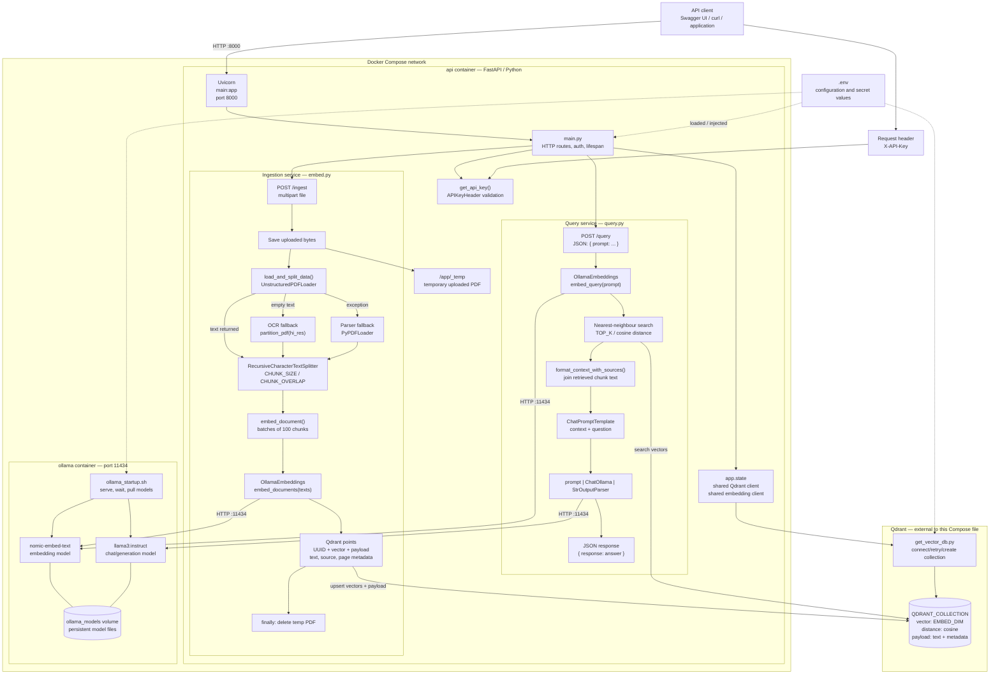
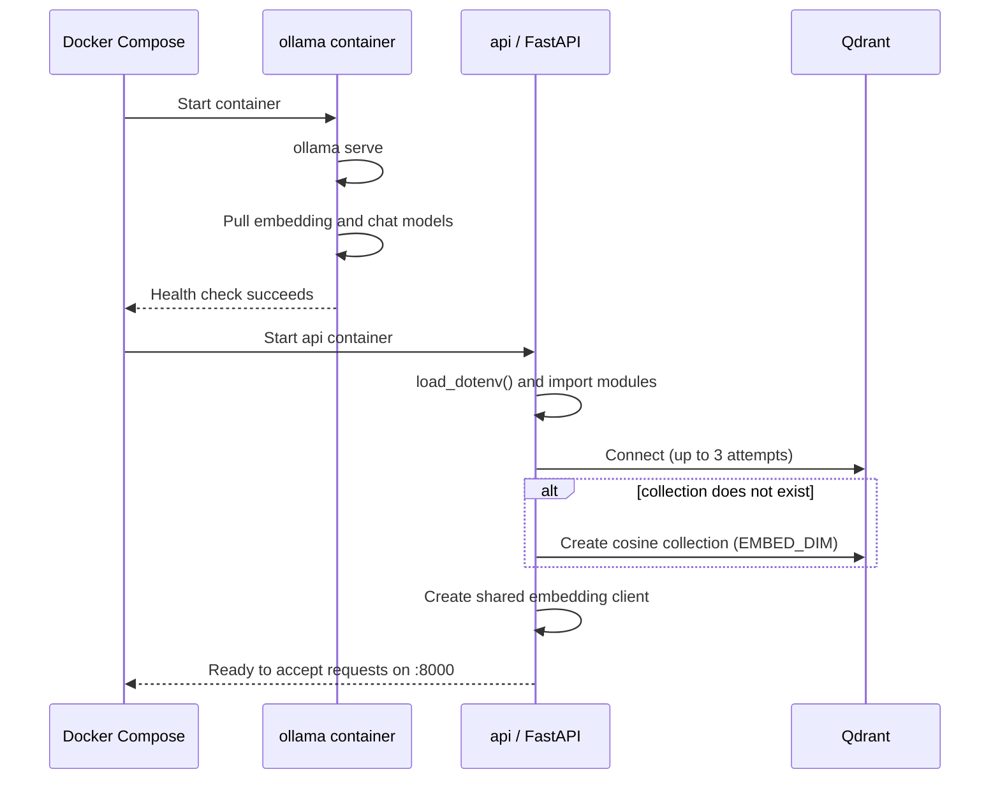

# Architecture diagram

## How to read it

1. An API client reaches Uvicorn on port 8000 and provides `X-API-Key`.
2. `main.py` authenticates the request and uses resources created once during
   its lifespan: a Qdrant client and an Ollama embedding client.
3. `/ingest` follows the orange-left conceptual branch: save → extract PDF
   text → split → embed → upsert Qdrant points → delete the temporary PDF.
4. `/query` follows the blue-right conceptual branch: embed prompt → retrieve
   nearest chunks → construct context → ask the LLM → return text.
5. Ollama is local to the Compose network. Qdrant is not: its URL comes from
   `.env`, so it may be a local installation or Qdrant Cloud.

## Runtime startup sequence

The diagrams use Mermaid, which renders automatically on GitHub and in most
modern Markdown viewers. If your editor does not render Mermaid, open this
file in GitHub or use its Markdown preview extension.
